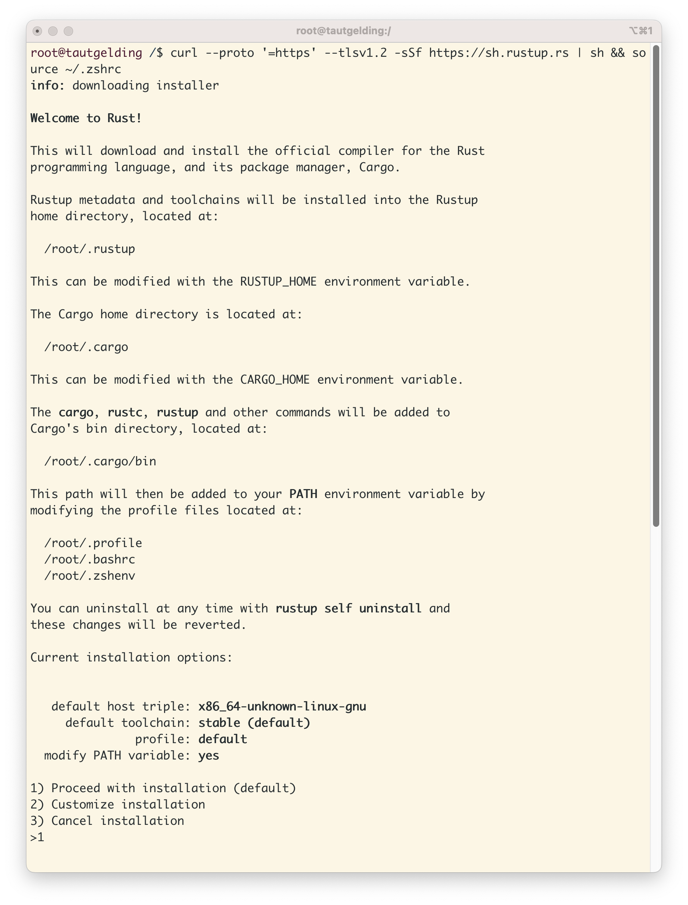
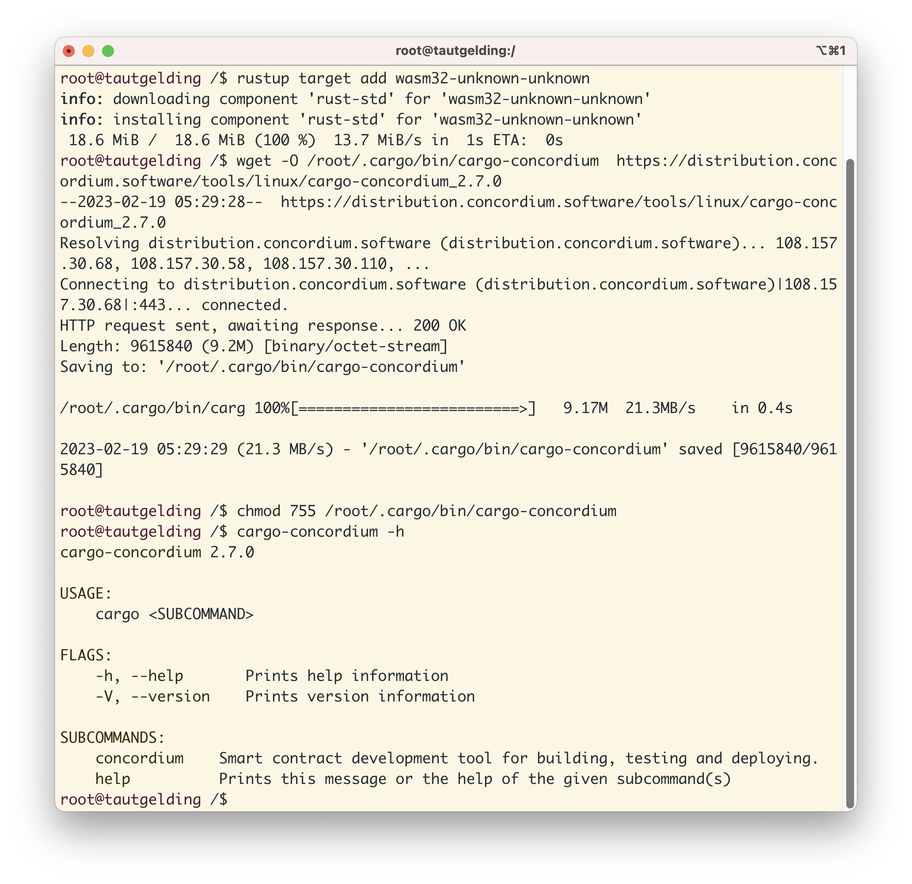

# Concordium Hackathon Task 1: Concordium Blockchain Development Env
## Install Rust
Firstly, Rust, a programming language required to develop and deploy smart contracts on Concordium, must be installed.

## Install Cargo-Concordium

## Install Concordium-Client

## Creating a Testnet Account and acquiring testnet CCD
Creating a Testnet account is important for testing smart contracts on the network. Follow the instructions on this website: htOnce an account is created, acquire testnet CCD via CCD faucet 

## Export the account from web wallet and import it into Concordium client

## Mainnet
2xd1MhXinD9eWW8XYR4MK5kEfe8rTvRs83QBRguGffn23ozQRS
