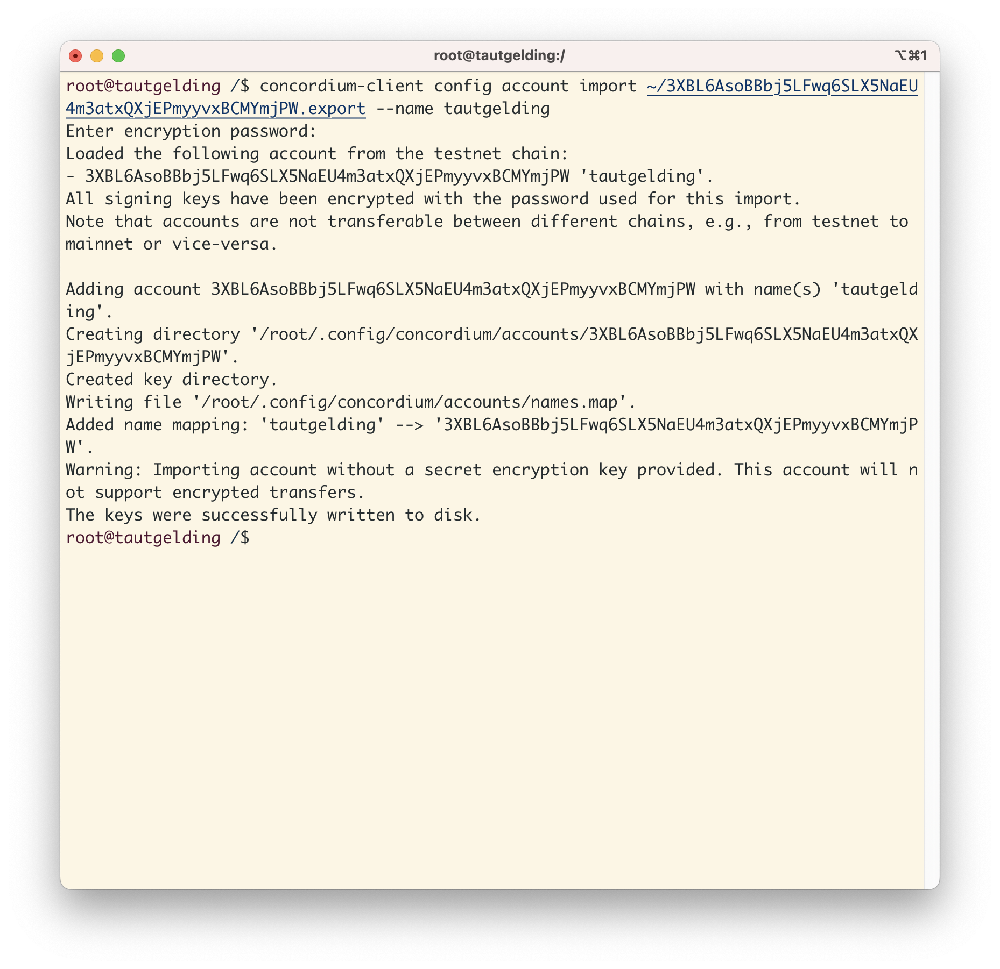

Concordium Hackathon Task 1: Concordium Blockchain Development Env

Installation Guide

## Step 1: Install Rust
Firstly, Rust, a programming language required to develop and deploy smart contracts on Concordium, must be installed. Follow the instructions on this website: https://www.rust-lang.org/tools/install

## Step 2: Install cargo-concordium
Cargo-concordium is a command-line tool that provides features such as compiling smart contracts, deploying them to the Concordium network and managing accounts. The installation guide is provided in the Concordium official documentation.

## Step 3: Install Concordium-Client
Concordium-Client is a graphical user interface that allows developers to manage their accounts, transactions, and smart contracts. Visit https://github.com/Concordium/concordium-client/releases to get started.

###Creating a Testnet Account

Step 4: Create a Testnet account and acquiring testnet CCD via the CCD faucet
Creating a Testnet account is important for testing smart contracts on the network. Follow the instructions on this website: https://developer.concordium.software/docs/quick-start/testnet-accounts/
Once an account is created, acquire testnet CCD on https://faucet.concordium.software/.

Export the account from web wallet and import it into Concordium client
After creating a Testnet account, export the account from the web wallet by following the instructions on this website: https://developer.concordium.software/docs/quick-start/testnet-accounts/

Then, import the account into Concordium client by following the guide on https://developer.concordium.software/docs/concordium-client/importing-an-account/

## Mainnet
2xd1MhXinD9eWW8XYR4MK5kEfe8rTvRs83QBRguGffn23ozQRS

## Mainnet
2xd1MhXinD9eWW8XYR4MK5kEfe8rTvRs83QBRguGffn23ozQRS
